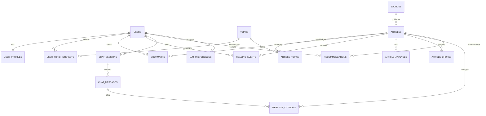

# Database design

## Design choices

- PostgreSQL is the system of record for product and user data.
- A vector store holds embedding vectors and chunk references only; it does not replace relational records.
- UUID primary keys, UTC timestamps, and soft deletion for user-owned records are the defaults.
- Article source content and AI-generated content are stored separately so the UI can label them accurately.
- No third-party API keys are stored per user in the MVP. Gemini credentials remain server-side; an Ollama choice stores only model preferences.

## Entity relationship diagram

## Core tables

| Table | Purpose | Key fields |
| --- | --- | --- |
| `users` | Authentication identity | `id`, `email`, `password_hash`, `is_active`, `created_at` |
| `user_profiles` | Display and reading preferences | `user_id`, `display_name`, `explanation_level`, `timezone` |
| `llm_preferences` | Per-user AI behaviour choices | `user_id`, `provider`, `model`, `temperature`, `max_output_tokens` |
| `topics` | Normalized subjects | `id`, `slug`, `name`, `description` |
| `user_topic_interests` | Explicit topic preferences | `user_id`, `topic_id`, `weight`, `created_at` |
| `sources` | Trusted sources and ingestion metadata | `id`, `name`, `base_url`, `feed_url`, `source_type`, `is_active` |
| `articles` | Canonical article metadata and normalized content | `id`, `source_id`, `canonical_url`, `title`, `published_at`, `content_text`, `content_hash`, `language`, `status` |
| `article_topics` | Article-to-topic relation with confidence | `article_id`, `topic_id`, `confidence`, `assigned_by` |
| `article_analyses` | AI outputs shown on the article page | `id`, `article_id`, `analysis_type`, `content`, `provider`, `model`, `prompt_version` |
| `article_chunks` | Retrieval-ready source content | `id`, `article_id`, `chunk_index`, `content`, `embedding_ref`, `content_hash` |
| `bookmarks` | Saved articles | `user_id`, `article_id`, `created_at` |
| `reading_events` | Behavioural personalization signals | `id`, `user_id`, `article_id`, `event_type`, `duration_seconds`, `occurred_at` |
| `chat_sessions` | Conversation scope and ownership | `id`, `user_id`, `scope_type`, `article_id`, `topic_id`, `title` |
| `chat_messages` | User and assistant messages | `id`, `session_id`, `role`, `content`, `provider`, `model`, `created_at` |
| `message_citations` | Evidence for an assistant response | `message_id`, `article_id`, `chunk_id`, `ordinal` |
| `recommendations` | Explainable feed ranking results | `id`, `user_id`, `article_id`, `score`, `reason`, `algorithm_version`, `generated_at` |

## Important constraints and indexes

| Area | Constraint or index |
| --- | --- |
| Identity | Unique, case-normalized `users.email` |
| Sources | Unique `sources.feed_url` when present |
| Deduplication | Unique `articles.canonical_url`; indexed `content_hash` for near-duplicate detection |
| Topics | Unique `topics.slug`; composite unique key on `article_topics(article_id, topic_id)` |
| User records | Composite unique keys on `bookmarks(user_id, article_id)` and `user_topic_interests(user_id, topic_id)` |
| Feed | Index `recommendations(user_id, generated_at DESC, score DESC)` |
| Timeline | Index `articles(published_at DESC)` and `articles(source_id, published_at DESC)` |
| Retrieval | Index `article_chunks(article_id, chunk_index)`; vector-store metadata includes `article_id`, source, topic ids, and publication time |
| Chat | Index `chat_messages(session_id, created_at)` and `message_citations(message_id, ordinal)` |

## Controlled values

| Field | Allowed MVP values |
| --- | --- |
| `articles.status` | `pending`, `processed`, `failed`, `archived` |
| `article_analyses.analysis_type` | `summary`, `key_takeaways`, `neutral`, `developer`, `student`, `investor`, `economist`, `optimistic`, `skeptical` |
| `reading_events.event_type` | `impression`, `open`, `complete`, `bookmark`, `dismiss`, `search` |
| `chat_sessions.scope_type` | `article`, `topic`, `global` |
| `chat_messages.role` | `user`, `assistant`, `system` |
| `llm_preferences.provider` | `gemini`, `ollama` |
| `user_profiles.explanation_level` | `beginner`, `balanced`, `technical` |

## Privacy and retention

- Passwords are stored only as a modern salted hash; never store plaintext credentials.
- Reading events are private to the user and are never exposed as public analytics.
- A user can delete bookmarks, chats, preferences, and their account; account deletion cascades or anonymizes user-owned records without deleting shared editorial article data.
- Chat messages must not be used for model training or provider logging beyond the configured provider’s necessary request handling without explicit user consent.
- `article_analyses` and assistant messages retain provider, model, and prompt version metadata for transparency and debugging.

## Migration plan

Alembic will manage schema changes. The first backend milestone creates identity, source, article, topic, bookmark, and preference tables. Retrieval, chat, and recommendation tables follow once their service contracts are implemented.
